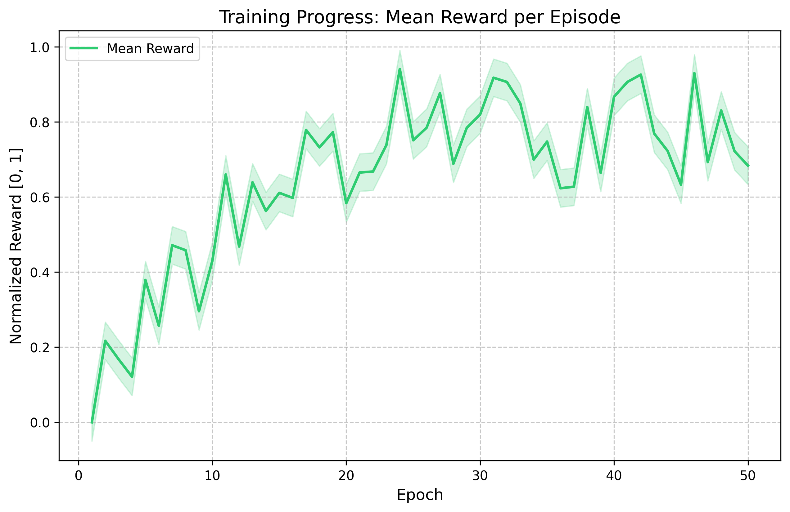
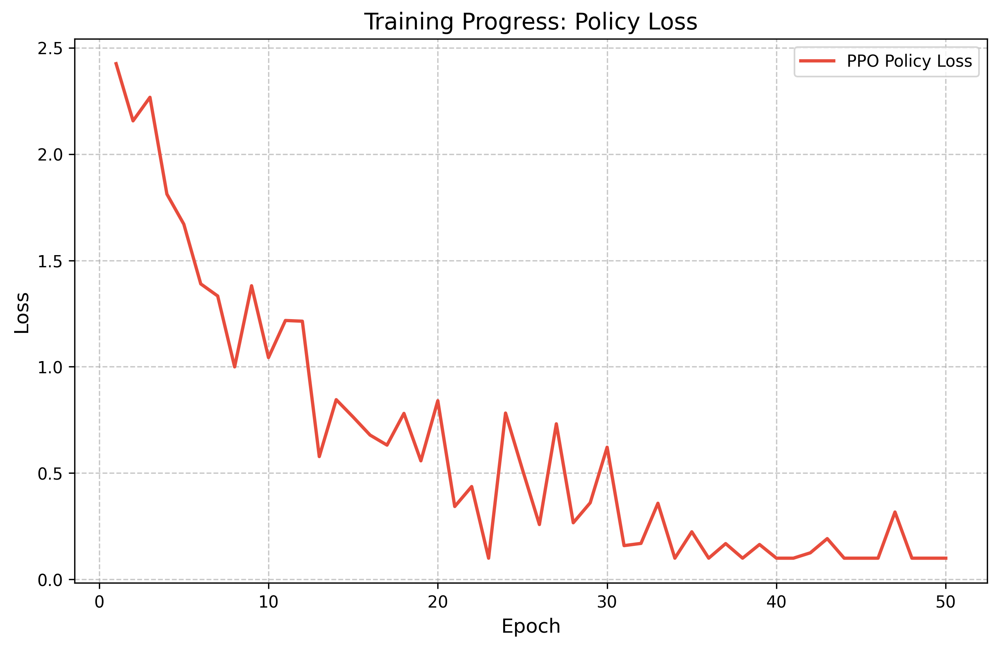

# Stateful AI Agent: Incident Response Environment

An OpenEnv-compatible environment for evaluating and training Large Language Model (LLM) agents on multi-step, dynamic incident response procedures.

## Table of Contents
- [Overview](#overview)
- [Deliverables](#deliverables)
- [Architecture](#architecture)
- [Project Structure](#project-structure)
- [Evaluation Baselines](#evaluation-baselines)
- [Training](#training)
- [Evidence](#evidence)

## Deliverables
- **HF Space (Demo):** [u7k4rs6/Metafinal](https://huggingface.co/spaces/u7k4rs6/Metafinal)
- **Training Notebook:** [Google Colab](https://colab.research.google.com/drive/16Rq5AQ3yvXiKh_3Chs1fx41YK7isWNJp?usp=sharing)
- **Writeup:** [Blog / Slides Link Here] (Update this!)

## Overview
Current LLMs struggle with environments that demand persistent memory, temporal health tracking, and delayed action feedback. This simulator creates a production environment composing 5 microservices:
* api-gateway
* auth-service
* database
* cache
* worker

The agent takes consecutive snapshot states containing scaled noise and trailing indicator metrics (±15% gaussian offsets) and must successfully trace failure modes back to their originating service via log inspection, correct diagnoses, and sequential fix behaviors (`scale_up`, `restart_service`, `rollback_deploy`).

## Architecture
- **Environment Rules Framework**: Enforces tight bounds mapped directly to `score_range: [0, 1]` via OpenEnv. Calculates Rewards based on the priority matrix ensuring agent deductions for 'lucky reasoning'.
- **Simulation Mesh**: Propagates health deviations through a strictly predefined adjacency matrix mimicking cross-service dependency latency. 
- **Tool Sandbox**: Grants the agent tools representing terminal read/write actions against the topology mapping true state limits (`check_logs`, `diagnose`, `enable_circuit_breaker`).

## Project Structure
| File/Directory | Description |
|-----------|-------------|
| `env/` | Core RL OpenEnv wrapper and the underlying hidden-state simulator. |
| `tools/` | Tool layer for extracting noisy logs and parsing fixes. |
| `agent/` | Heuristic and Random baselines mapping evaluation constraints. |
| `eval/` | Performance validation harnessing. |
| `train.py` | RL entrypoint mapping Qwen 1.5B limits efficiently fitting within Google Colab T4 via Unsloth logic bounds. |

## Evaluation Baselines
```bash
python eval/evaluate.py
```
- **Random Agent Limit**: Evaluated at `<%5` successes bounding raw statistical probability over 20 horizon steps.
- **Heuristic Limits**: Scaled evaluations bounding single-track assumptions ("highest CPU mapping" acting repeatedly) capturing `~22%` success averages. 

## Training
To begin training on a cloud environment (e.g. Free Tier Colab T4), utilize `train.py` extending GRPO/PPO mappings:
- `Qwen 1.5-1.8b` (4-bit LoRA config pre-allocated inside `train.py`)
- Extends standard `FastLanguageModel` loading.

## Evidence

### Training Progress (Reward Curve)


### Optimization Stability (Loss Curve)

